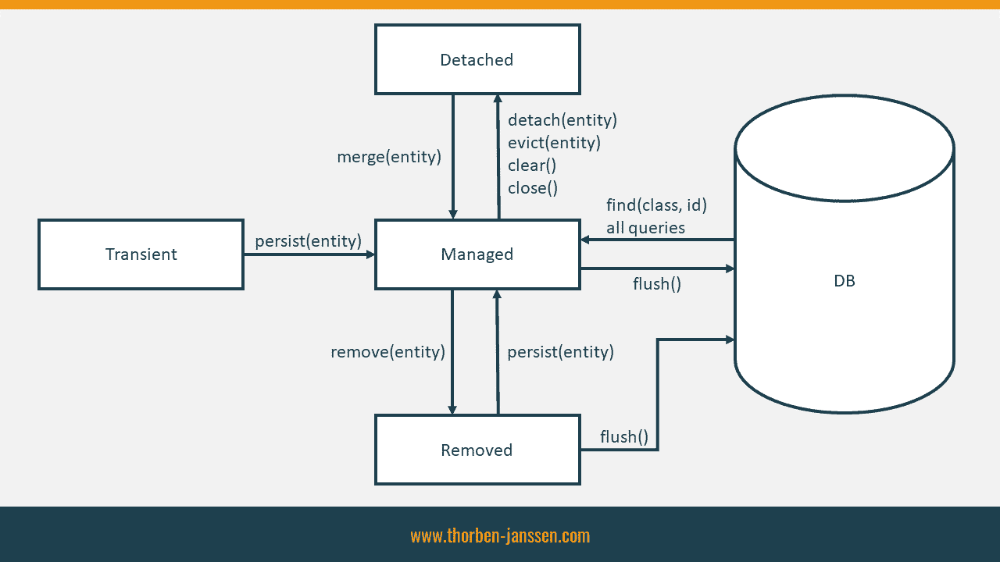
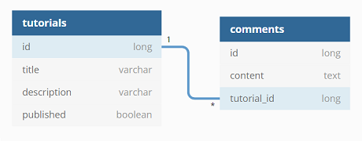
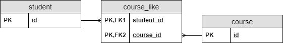

# demo-n-to-many

demo JPA, Hibernate, 1-to-many and more

# Entity Lifecycle Model in JPA & Hibernate



**Transient**
The lifecycle state of a newly instantiated entity object is called transient. The entity hasn’t been persisted yet, so it doesn’t represent any database record.

**Managed**
All entity objects attached to the current persistence context are in the lifecycle state managed.

**Detached**
An entity that was previously managed but is no longer attached to the current persistence context is in the lifecycle state detached.

**Removed**
When you call the remove method on your EntityManager, the mapped database record doesn’t get removed immediately. The entity object only changes its lifecycle state to removed.

# Overview of JPA/Hibernate Cascade

# GenerationType  IDENTITY vs SEQUENCE vs AUTO

## AUTO Generation

If we're using the default generation type, the persistence provider will determine values based on the type of the primary key attribute. This type can be numerical or UUID.

For numeric values, the generation is based on a **Sequence or Table** generator, 
```java
 @Id
    @GeneratedValue
    private long studentId;
```
while UUID values will use the **UUID** Generator.
```java
 @Id
    @GeneratedValue
    private UUID studentId;
```

## IDENTITY Generation

**IDENTITY** sequencing uses **special IDENTITY columns** in the database to allow the database to automatically assign an id to the object when its row is inserted. Identity columns are supported in many databases, such as MySQL, DB2, SQL Server, Sybase and Postgres. Oracle does not support IDENTITY columns but they can be simulated through using sequence objects and triggers.

## SEQUENCE Generation

This generator uses **SEQUENCE object** if our database supports them. It switches to table generation if they aren't supported.

In order to customize the sequence name, we can use the @GenericGenerator annotation with SequenceStyleGenerator strategy.

# JPA One To Many example



# JPA Many To Many example




@ManyToMany annotation is used for Many-to-Many association between two entities: Tutorial and Tag.

Every Many-to-Many relationship has two sides:

* the owning side
* the non-owning (inverse side)

In this demo, Tutorial entity is the owner of the relationship and Tag entity is the inverse side.

*The **join table** is specified on the **owning side** (Tutorial) using **@JoinTable** annotation. This relationship is bidirectional, the **inverse side** (Tag) must use the **mappedBy** element to specify the **relationship field or property** of the **owning side**.*

So, the side which doesn’t have the **mappedBy** attribute is the owner, the side which has the **mappedBy** attribute is the inverse side.

The owner side is the side which Hibernate looks at to know which association exists. For example, if you add a Tag in the set of tags of a Tutorial, a new row will be inserted by Hibernate in the join table (tutorial_tags). On the contrary, if you add a Tutorial to the set of tutorials of a Tag, nothing will be modified in the database.

@JsonIgnore is used to ignore the logical property used in serialization and deserialization

```java
@Entity
@Table(name = "tutorials")
public class Tutorial {
    @ManyToMany(fetch = FetchType.LAZY,
      cascade = {
          CascadeType.PERSIST,
          CascadeType.MERGE
      })
    @JoinTable(name = "tutorial_tags",
        joinColumns = { @JoinColumn(name = "tutorial_id") },
        inverseJoinColumns = { @JoinColumn(name = "tag_id") })
    private Set<Tag> tags = new HashSet<>();
}

@Entity
@Table(name = "tags")
public class Tag {
    @ManyToMany(fetch = FetchType.LAZY,
      cascade = {
          CascadeType.PERSIST,
          CascadeType.MERGE
      },
      mappedBy = "tags")
    @JsonIgnore
    private Set<Tutorial> tutorials = new HashSet<>();
}
```

# JPA one-to-one 

implement solution

* Implementing With a Shared Primary Key, Child Table copy PK from Parent
* impl with a Foreign Key, Parent Table owns the foreign key column
* Implementing With a Join Table 

Some Notes

* **@PrimaryKeyJoinColumn** , PrimaryKey work as JoinColumn
* **@JoinColumn(name = "post_id")** , means the foreign key column is defined in this Table
* **@MapsId**, means PK values will be copied from the Parent entity
* @OneToOne(**mappedBy = "details"**) , means the "foreign key" is in another table


# "Detached entity passed to persist" solution

1. only use CascadeType.MERGE instead of CascadeType.PERSIST or CascadeType.ALL

# Bidirectional parent-child associations

The most common & the most efficient approach is when the **@ManyToOne** side controls the association 
and the **@OneToMany** end is using the “**mappedBy**” option.

# Set Is Better Than List in unidirectional @ManyToMany, @OneToMany with join_table

**collection is List**

when remove a child branch1, Hibernate delete all branch then re-insert branch2 and branch3 in JoinTable
```java

@Entity
public class Company {
    @OneToMany(cascade = CascadeType.ALL, orphanRemoval = true)
    @JoinTable(name = "company_list_branch")
    private List<Branch> branchList = new ArrayList<>();
}

// runtime sql : delete all then insert other again in join table 
// delete from company_list_branch where company_id=?
// insert into company_list_branch (company_id, other_branch_list_id) values (?, ?)
```

**collection is Set**

when remove a child branch1, Hibernate only issue single delete sql "delete * from JoinTable where id=?"
```java

@Entity
public class Company {
    @OneToMany(cascade = CascadeType.ALL, orphanRemoval = true)
    @JoinTable(name = "company_set_branch")
    private Set<Branch> branchList = new HashSet<>();
}

// runtime SQL : simply delete from join table
// delete from company_set_branch where company_id=? and branch_list_id=?
```

**Preserving the Order of the ResultSet**

* Use @OrderBy to ask the database to order the fetched data by the given columns,
* Use @OrderColumn to permanently order this via an extra column

Behind the scenes, Hibernate will preserve the order via a **LinkedHashSet**.

```java
@Entity
public class Company {
    @OneToMany(cascade = CascadeType.ALL, orphanRemoval = true)
    @OrderBy("name DESC")
    private Set<Branch> branchList = new LinkedHashSet<>();
}
```

# Problem with one-to-many

in reality, **@OneToMany** is practical only when the number of child records is rather limited.
>Maybe **@OneToFew** would have been a more suggestive name for this annotation.

#  Bidirectional @OneToMany is more efficient than Unidirectional @OneToMany

### Unidirectional @OneToMany
```java
@Entity
public class Company {
    @OneToMany(cascade = CascadeType.ALL, orphanRemoval = true)
    @JoinColumn(name = "company_id")
    private Set<Branch> branchList = new HashSet<>();
    public void addBranch(Branch branch) {
        branchList.add(branch);
    }
}

@Entity
public class Branch {
    // ...
}
```
// add Branch Entity
```java
company.addBranch(branch1);
companyService.save(company);

// 2 SQL: first insert then update, which is not efficient

// insert into branch (name, id) values (?, ?)
// update branch set company_id=? where id=?
```
// remove Branch Entity
```java
company.removeBranch(branch1);
companyService.save(company);

// 2 SQL: first update ref_id null then delete, which is not efficient

// update branch set company_id=null where company_id=? and id=?
// delete from branch where id=?
```


### Bidirectional @OneToMany

```java
@Entity
public class Company {
    @OneToMany(cascade = CascadeType.ALL, orphanRemoval = true, mappedBy="company")
    private Set<Branch> branchList = new HashSet<>();
    public void addBranch(Branch branch) {
        branchList.add(branch);
    }
}

@Entity
public class Branch {
    @ManyToOne(fetch = FetchType.LAZY)
    @JoinColumn(name = "company_id")
    private Company company;
}
```
// add Branch Entity
```java
company.addBranch(branch1);
companyService.save(company);

// only one SQL is executed when adding child entity
// insert into branch (name, company_id, id) values (?, ?, ?)
```
// remove Branch Entity
```java
company.removeBranch(branch1);
companyService.save(company);

// only one SQL is executed when deleting child entity
// delete from branch where id=?
```

Note: 

* child entity should implement the *equals and hashCode* methods
* parent entity should provide two utility methods (e.g. addComment and removeComment) which are used to synchronize both sides of the bidirectional association.

# @ManyToOne might be just enough

Just because you have the option of using the @OneToMany annotation, 
it does not mean this should be the default option for every one-to-many 
database relationship. **The problem with @OneToMany is that we can only use them 
when *the number of child records is rather limited***.

Therefore, most of the time, the **@ManyToOne** annotation on the child side is 
**everything you need**. But then, how do you get the child entities associated 
with a Post entity?

Well, all you need is just a single JPQL query:
```java
select pc.id AS id1_1_,
       pc.post_id AS post_id3_1_,
       pc.review AS review2_1_
    from post_comment pc 
    where  pc.post_id = 1
```

The **@ManyToOne** association is the **most natural and also efficient** way of mapping 
one-to-many database relationship.
```html
https://vladmihalcea.com/the-best-way-to-map-a-onetomany-association-with-jpa-and-hibernate/
```

If we just use @ManyToOne then how to delete Parent Entity?

> Customize Repository, which overrides the delete method and issues a bulk delete against the children. 
> That’s a very efficient option.

# Using an @EntityGraph annotation

An entity graph is a JPA feature that enables you to define which associations your persistence provider
shall initialize when fetching an entity from the database.

```java
@Entity
public class Course {
    ...
}
@Entity
public class Student  {
    @ManyToMany(cascade = {CascadeType.PERSIST, CascadeType.MERGE}, fetch = FetchType.LAZY)
    private Set<Course> likedCourses = new HashSet<>();
    ...
}

public interface StudentStore extends CrudRepository<Student, Integer> {
    @EntityGraph(attributePaths = "likedCourses")
    public List<Student> findByTitle(String name);
}
```
Using **@EntityGraph(attributePaths = "...")** will fetch association in one query.

# Query Projection

```java
public interface StudentStore extends JpaRepository<Student, Integer> {
    // projection with Interface
    @Query("select s.age, s.title from Student s")
    public List<StudentView> findAllView();

    // projection with DTO object
    @Query("select new com.example.demo.many2many.data.StudentDTO(s.age, s.title) from Student s")
    public List<StudentDTO> findAllDto();
}
```

**projection with Interface**
```java
public interface StudentView {
    Integer getAge() ;
    String getTitle();
}
////
List<StudentView> studentViews = studentStore.findAllView();
```
Interface Projection is auto mapped with field name, 

but a downside to using the Proxy projection. We cannot provide a specific implementation 
for equals and hashCode, and this limits its usability.

**projection with DTO object**
```java
public class StudentDTO {
    private Integer age = null;
    private String title;
    public StudentDTO(Integer age, String title) {
        this.age = age;
        this.title = title;
    }
}
///
List<StudentDTO> studentDTOS =  studentStore.findAllDto();
```

DTO projection is Faster than Interface projection;

**return Complex nested DTO via ResultTransformer**

create the Result Transformer
```java
public class StudentDTOResultTransformer implements org.hibernate.transform.ResultTransformer {
    private final static int INDEX_AGE = 0;
    private final static int INDEX_TITLE = 1;
    private final static int INDEX_NAME = 2;
    private Map<String, StudentDTO> data = new LinkedHashMap<>(); // suppose Title is unique as the key
    @Override
    public Object transformTuple(Object[] tuple, String[] aliases) {
        Objects.requireNonNull(tuple[INDEX_TITLE]);
        // return DTO if existed or else create new one. 
        StudentDTO studentDTO = data.computeIfAbsent((String) tuple[INDEX_TITLE], 
                x->new StudentDTO((Integer) tuple[INDEX_AGE], (String) tuple[INDEX_TITLE]));
        // then add the nested DTO
        studentDTO.addCourse(new CourseDTO((String) tuple[INDEX_NAME]));
        return studentDTO;
    }

    @Override
    public List transformList(List collection) {
        // return the nested DTO list
        return  new ArrayList(data.values());
    }
}
```


define and impl custom interface
```java
public interface StudentRepo {
    // projection with Complex DTO object,
    public List<StudentDTO> findComplexStudentDTO();
}
// impl the custom interface
public class StudentRepoImpl implements StudentRepo{
    private final String sql = "select a.age as age, a.title as title, b.name as name from ... ";
    @PersistenceContext
    private EntityManager entityManager;
    @Override
    public List<StudentDTO> findComplexStudentDTO() {
        return entityManager.createNativeQuery(sql)
                .unwrap(org.hibernate.query.Query.class)
                .setResultTransformer(new StudentDTOResultTransformer())
                .getResultList();
    }
}

```
extends custom interface
```java
public interface StudentStore extends JpaRepository<Student, Integer>, StudentRepo { ... };
```
call the custom function
```java
List<StudentDTO> complexStudentDTOS =  studentStore.findComplexStudentDTO();
```

the end result is DTO with nested DTO.
```shell
 StudentDTO{age=30, title='Lexi', likedCourses='[CourseDTO{name='AWS'}, CourseDTO{name='Web 3.0'}, CourseDTO{name='C++'}]'}
 StudentDTO{age=null, title='Tiger', likedCourses='[CourseDTO{name='java'}, CourseDTO{name='NodeJs'}, CourseDTO{name='Web 3.0'}]'}
 StudentDTO{age=40, title='Joe', likedCourses='[CourseDTO{name='java'}, CourseDTO{name='NodeJs'}, CourseDTO{name='AWS'}]'}
```